# PrivEdge — Secure Edge–Cloud Conversational AI

> **PrivEdge does not simply answer a user's question. It first decides how that question should be handled safely and appropriately.**

PrivEdge is a privacy-aware, risk-aware conversational AI framework. Every query is analyzed for privacy, sensitivity, complexity, risk and latency need, and an **Intelligent Router** then sends it to one of three processing paths: **Edge AI** (local), **Cloud AI** (Google Gemini) or **Human Review** (a reviewer). The user never chooses the path — the backend decides.

---

## Terminology used throughout this project

| Term | Meaning |
|---|---|
| **PrivEdge** | The complete secure Edge–Cloud conversational AI framework (frontend, backend, analyzers, router, AI paths, security, storage, analytics). |
| **AI Assistant** | The conversational interface inside PrivEdge that users type into (the AI Assistant page and the floating assistant). It is *not* a separate chatbot and it does *not* choose the route. |
| **Intelligent Router** | The decision-making component that decides where each query is processed. |
| **Edge AI** | Local AI processing using **Ollama** with **Llama 3.2** (`llama3.2:3b`). |
| **Cloud AI** | Cloud generative AI processing using **Google Gemini**. |
| **Human Review** | The manual / high-risk path in which a human reviewer approves, modifies or rejects the response. |

---

## Table of contents

1. [Project Overview](#1-project-overview)
2. [Problem Statement](#2-problem-statement)
3. [Proposed Solution](#3-proposed-solution)
4. [Objectives](#4-objectives)
5. [Key Features](#5-key-features)
6. [System Architecture](#6-system-architecture)
7. [Technology Stack](#7-technology-stack)
8. [Intelligent Routing](#8-intelligent-routing)
9. [Edge AI](#9-edge-ai)
10. [Cloud AI](#10-cloud-ai)
11. [Human Review](#11-human-review)
12. [RAG / Knowledge Base](#12-rag--knowledge-base)
13. [Security](#13-security)
14. [User / Reviewer / Admin Roles](#14-user--reviewer--admin-roles)
15. [Project Structure](#15-project-structure)
16. [Installation](#16-installation)
17. [How to Run](#17-how-to-run)
18. [Testing](#18-testing)
19. [ML Evaluation](#19-ml-evaluation)
20. [Screenshots](#20-screenshots)
21. [Limitations](#21-limitations)
22. [Future Enhancements](#22-future-enhancements)
23. [Team](#23-team)

Detailed documentation lives in [`docs/`](docs/) — see the [documentation index](#documentation-index) at the end.

---

## 1. Project Overview

PrivEdge is a full-stack application (React + FastAPI) that provides a conversational AI experience while treating *how a request is processed* as a first-class concern. A user types a question in the AI Assistant; before any model sees it, PrivEdge analyses the text and selects the safest appropriate destination:

```text
User → AI Assistant → Query analysis → Intelligent Router ─┬─▶ Edge AI       (local, Ollama + Llama 3.2)
                                                          ├─▶ Cloud AI      (Google Gemini, masked input)
                                                          └─▶ Human Review  (reviewer approves / modifies / rejects)
                                                  ↓
                                          Response validation → Database / logs → User
```

The project's main contribution is the **decision layer** around conversational AI — not the chatbot itself. It is a student implementation/prototype inspired by the Gen-Edge-AI idea of combining generative AI, edge AI and human expertise; the routing implementation, dataset, architecture and evaluation are this project's own.

## 2. Problem Statement

Conventional generative-AI chat systems send every request to a cloud model. That creates several problems:

- **Privacy** — personal, financial, medical or confidential text may leave the user's environment.
- **Risk** — some questions (medical, legal, high-stakes decisions) should not be answered automatically by an AI.
- **Capability vs. locality** — local models keep data on the machine but are less capable; cloud models are stronger but external.
- **Accountability** — routing decisions are rarely logged or reviewable.

## 3. Proposed Solution

PrivEdge places an **analysis and routing layer** in front of the models. Each query is converted into features (privacy, sensitivity, complexity, risk, latency, human-required, PII, domain) and routed:

- sensitive or private → **Edge AI**, so the raw text is processed locally;
- high-risk or judgement-dependent → **Human Review**;
- general or complex but non-sensitive → **Cloud AI**, with sensitive-looking identifiers masked first.

Every decision, its scores and its reason are stored, shown to the user, and available to administrators for audit and analytics.

## 4. Objectives

1. Build a working conversational AI that decides *where* each query is processed.
2. Detect privacy, sensitivity, complexity and risk using regex, keyword and context analysis (spaCy NER optional).
3. Implement a documented rule-based router and a trained Random Forest router, with safety guardrails.
4. Provide three processing paths — local Edge AI, Cloud AI and Human Review — with an end-to-end reviewer workflow.
5. Provide authentication, role-based access, encryption of stored conversation text, data masking and audit logging.
6. Provide role-specific dashboards and analytics, and evaluate the router honestly.

## 5. Key Features

- **Intelligent routing** — rule-based (default) and Random Forest (`ROUTER_MODE=ml`) routers sharing the same safety guardrails.
- **Edge AI** with Ollama + Llama 3.2; sensitive text is not sent to the cloud.
- **Cloud AI** with Google Gemini; only masked text and cloud-route history are sent.
- **Human Review** — queue, claim, approve / modify / reject, with a locally generated AI draft and masked text for reviewers.
- **Response validation** before anything is returned.
- **Conversations & history** — per-user, searchable, filterable by route, renameable and deletable.
- **File attachments** (`.txt`, `.md`, `.pdf`, up to 3 MB) analysed and routed exactly like typed text.
- **RAG / Knowledge Base** — TF-IDF retrieval over published documents; content search with in-document highlighting.
- **Floating AI Assistant** available across the app, using the same `/chat` pipeline.
- **Dashboards** — User Dashboard & Insights, Reviewer Dashboard & Analytics, Admin Dashboard, Routing Analytics, Query Logs, Review Monitoring, System Monitoring.
- **Admin settings that are really enforced** — route enable/disable, auto-routing, audit logging, idle-session timeout, RAG toggle, temperature, context window and notification toggles.
- **In-app notifications** — review outcomes, high-risk queries, system alerts, review backlog.
- **Security** — JWT, bcrypt, RBAC, Fernet encryption of stored text, data masking, audit log, conversation isolation.

## 6. System Architecture

```text
                              ┌──────────────────────────┐
                              │  React + TypeScript UI   │  (Vite, role-based pages)
                              │  AI Assistant · Dashboards│
                              └────────────┬─────────────┘
                                           │ REST / JSON (JWT)
                              ┌────────────▼─────────────┐
                              │      FastAPI backend      │
                              │ auth · RBAC · validation  │
                              └────────────┬─────────────┘
                                           │
        ┌──────────────────────────────────▼───────────────────────────────────┐
        │ Query analysis:  Privacy · Sensitivity · Complexity · Risk · Latency  │
        │ Feature extraction  →  Intelligent Router (rule-based / Random Forest)│
        │                        + safety guardrails + admin route toggles      │
        └───────────────┬──────────────────────┬──────────────────────┬────────┘
                        │                      │                      │
                ┌───────▼───────┐      ┌───────▼───────┐      ┌───────▼───────┐
                │   Edge AI     │      │   Cloud AI    │      │ Human Review  │
                │ Ollama +      │      │ Google Gemini │      │ reviewer queue│
                │ Llama 3.2     │      │ (+ RAG, mask) │      │ + local draft │
                └───────┬───────┘      └───────┬───────┘      └───────┬───────┘
                        └──────────────────────┼──────────────────────┘
                                   ┌───────────▼───────────┐
                                   │   Response validator   │
                                   └───────────┬───────────┘
                                   ┌───────────▼───────────┐
                                   │ SQLite · routing logs  │
                                   │ audit log · encryption │
                                   └───────────────────────┘
```

See [`docs/architecture/system-architecture.md`](docs/architecture/system-architecture.md) and [`docs/architecture/data-flow.md`](docs/architecture/data-flow.md).

## 7. Technology Stack

| Layer | Technology |
|---|---|
| Frontend | React 19, TypeScript, Vite, React Router, Tailwind CSS 4, Recharts, Lucide icons |
| Backend | Python, FastAPI, Uvicorn, Pydantic, SQLAlchemy |
| Database | SQLite (default `DATABASE_URL=sqlite:///./privedge.db`) |
| Edge AI | Ollama + Llama 3.2 (`llama3.2:3b`) |
| Cloud AI | Google Gemini REST API (model set by `GEMINI_MODEL`) |
| NLP / analysis | Regex, keyword & context analysis; spaCy NER is optional |
| Machine learning | scikit-learn (Random Forest, Logistic Regression, Decision Tree), joblib |
| RAG | scikit-learn TF-IDF + cosine similarity |
| Security | PyJWT, bcrypt, `cryptography` (Fernet) |
| Documents | pypdf (PDF text extraction) |
| Testing | pytest (backend); Vitest + React Testing Library + jsdom (frontend) |
| API docs | Swagger / OpenAPI at `http://127.0.0.1:8000/docs` |

Exact pinned versions: [`backend/requirements.txt`](backend/requirements.txt) and [`frontend/package.json`](frontend/package.json).

## 8. Intelligent Routing

The Intelligent Router receives the analyzer's features and returns **EDGE**, **CLOUD** or **HUMAN** plus a human-readable reason. Priority (highest first):

1. `human_required` **or** risk ≥ risk threshold → **Human Review**
2. privacy ≥ threshold **or** sensitivity ≥ threshold → **Edge AI**
3. high latency need **and** low complexity → **Edge AI**
4. everything else (including complex, non-sensitive queries) → **Cloud AI**

Two routers share this contract:

- **Rule-based router** (default) — the documented policy above.
- **Random Forest router** (`ROUTER_MODE=ml`) — a trained classifier; its output always passes through **safety guardrails** that can only make the result *more* protective (Cloud→Edge for private input; anything→Human for high-risk input). If the model file is missing it falls back to the rule router.

Admin route toggles and "Auto-Routing" are applied afterwards, and a private query is **never** silently re-routed to the cloud. Full detail: [`docs/architecture/intelligent-routing.md`](docs/architecture/intelligent-routing.md).

## 9. Edge AI

Edge AI is local processing through **Ollama** using **Llama 3.2** (`llama3.2:3b` by default, `OLLAMA_MODEL`). The raw query — including any attachment text — stays on the machine. Edge AI also produces the *AI draft* shown to Human Review reviewers, so even high-risk private text is not sent to the cloud for drafting. If Ollama is unavailable the user gets a clear error and the data is **not** sent elsewhere (the only fallback to Cloud is for non-private, latency-triggered routes).

## 10. Cloud AI

Cloud AI is **Google Gemini** (`GEMINI_MODEL`, default `gemini-3.8-flash`). Before a query is sent: sensitive-looking identifiers are masked (e.g. `[EMAIL]`), earlier private (Edge / Human) turns are excluded from the history, and — if RAG is enabled — relevant Knowledge Base context is added.

> **Note on availability.** Cloud AI integration is implemented and was previously verified successfully. During the latest manual testing, Gemini temporarily returned **HTTP 503** because the external Gemini service was experiencing high demand. This is an external service-availability condition, not a PrivEdge routing, API-key or backend failure; Cloud AI depends on Gemini being available. PrivEdge reports it to the user as a friendly "Cloud AI is currently unavailable" message and records a system-alert notification for admins.

## 11. Human Review

High-risk or judgement-dependent queries (for example medical, legal or high-stakes decisions) are routed to Human Review:

1. The user sees *"Human review is required. Your request has been sent for review."*
2. A review item is created; a draft is generated **locally by Edge AI** (best effort).
3. A reviewer (or admin) opens the item — seeing the **masked** query, the analysis and the draft — and **approves**, **modifies** or **rejects** it, with an optional comment.
4. The final response passes the response validator and appears in the user's conversation, and the user receives a notification.

## 12. RAG / Knowledge Base

> RAG and the Knowledge Base are **project extensions** that sit around the core routing architecture; they do not replace the router.

Admins manage Knowledge Base documents (create, edit, upload `.txt`/`.md`, archive). Uploads are screened for sensitive content before indexing. On the Cloud path, the masked query is matched against *published* documents using TF-IDF and cosine similarity (top 3 chunks above a minimum score) and the context is passed to Gemini. Users can browse and search documents (title, description and content) and highlight matches inside a document.

## 13. Security

Implemented controls: JWT authentication, bcrypt password hashing, role-based access control (USER / REVIEWER / ADMIN), idle-session timeout, Fernet encryption of stored message text, responses and AI drafts, regex-based data masking, response validation (masks leaked identifiers), conversation ownership checks, audit logging of account/admin/review actions, and privacy-aware routing. Reviewers see masked text only; administrators see routing metadata, not message content.

**Not implemented:** full MFA, HTTPS deployment, rate limiting, end-to-end encryption. See [`docs/security/security-documentation.md`](docs/security/security-documentation.md).

## 14. User / Reviewer / Admin Roles

| Area of the application | USER | REVIEWER | ADMIN |
|---|:-:|:-:|:-:|
| **User area** — Dashboard, AI Assistant, Conversations, Knowledge Base (browse / search), Insights, Profile, Settings | ✅ | – | – |
| **Reviewer area** — Dashboard, Review Queue, Review Query (claim, approve / modify / reject), Review History, Analytics | – | ✅ | – |
| **Admin area** — Dashboard, Users, Routing Analytics, Query Logs, Human Reviews (monitoring), Knowledge Base management, System Monitoring, System Settings | – | – | ✅ |
| Floating AI Assistant (same `/chat` pipeline) and notification bell | ✅ | ✅ | ✅ |

The frontend route guard sends each signed-in user to the area for their role. The backend enforces role boundaries independently (RBAC): review endpoints accept REVIEWER or ADMIN, admin endpoints accept ADMIN only, and chat, conversation, knowledge-browse and notification endpoints accept any authenticated user.

Role is assigned server-side; self-registration always creates a USER.

## 15. Project Structure

```text
PrivEdge/
├── README.md
├── docs/                          ← project documentation (this Step 6 deliverable)
├── backend/
│   ├── requirements.txt
│   ├── .env.example
│   ├── app/
│   │   ├── main.py                ← app factory, CORS, startup (tables, migration, seed)
│   │   ├── core/config.py         ← settings from .env
│   │   ├── db/                    ← database, models, seed, additive migration
│   │   ├── schemas/               ← Pydantic request models
│   │   ├── security/              ← JWT/bcrypt, RBAC dependencies, encryption, masking
│   │   ├── routes/                ← auth, chat, review, dashboard, admin, knowledge, notifications, health
│   │   ├── services/              ← analyzers, feature extractor, router, chat pipeline,
│   │   │                            cloud_ai, edge_ai, rag, validator, analytics, notifications, settings
│   │   └── ml/                    ← dataset generator, training, evaluation, trained model, reports
│   └── tests/                     ← pytest suite (53 tests)
└── frontend/
    ├── package.json, vite.config.ts
    └── src/
        ├── App.tsx                ← routes + role-aware auth guard
        ├── api/                   ← fetch client, shared types
        ├── contexts/              ← auth (AppContext), theme
        ├── components/            ← layout (Sidebar, TopBar), shared (RouteBadge, DecisionCard, FloatingAssistant…)
        ├── pages/                 ← public, user, reviewer, admin
        └── **/*.test.tsx          ← Vitest suites (34 tests)
```

## 16. Installation

**Prerequisites**

- Python 3.10+ (developed and tested with 3.12)
- Node.js 20 LTS or newer and npm
- [Ollama](https://ollama.com) installed locally
- A Google Gemini API key (for Cloud AI) — <https://aistudio.google.com/apikey>

**Backend**

```bash
cd backend
python -m venv venv
# Windows: venv\Scripts\activate        macOS/Linux: source venv/bin/activate
pip install -r requirements.txt
cp .env.example .env        # Windows: copy .env.example .env
```

Edit `backend/.env`: set `GEMINI_API_KEY`, and replace `JWT_SECRET` with a long random string. Optionally set `ENCRYPTION_KEY` (see `.env.example` for the generator command). **Never commit `.env`.**

**Frontend**

```bash
cd frontend
cp .env.local.example .env.local    # Windows: copy .env.local.example .env.local  (VITE_API_URL=http://localhost:8000)
npm install
```

**Edge AI model (once)**

```bash
ollama pull llama3.2:3b
```

## 17. How to Run

PrivEdge runs as **three processes** — open three terminals:

| Terminal | Purpose | Command | Address |
|---|---|---|---|
| 1 | Edge AI (Ollama + Llama 3.2) | `ollama run llama3.2:3b` *(or make sure the Ollama service is running)* | `http://localhost:11434` |
| 2 | Backend (FastAPI) | `cd backend` → activate venv → `python -m uvicorn app.main:app --port 8000` | `http://127.0.0.1:8000` |
| 3 | Frontend (Vite) | `cd frontend` → `npm run dev` | `http://localhost:5173` |

- Open **<http://localhost:5173>** and register an account (always created as a USER).
- Interactive API documentation (Swagger/OpenAPI): **<http://127.0.0.1:8000/docs>**.
- On first start the backend creates the SQLite database and seeds one **admin** (`admin@privedge.io`), one **reviewer** (`reviewer@privedge.io`) and six Knowledge Base documents. Their passwords come from `SEED_ADMIN_PASSWORD` / `SEED_REVIEWER_PASSWORD` in `.env` — change them before any shared use.
- To use the trained Random Forest router instead of the rule-based router, set `ROUTER_MODE=ml` in `.env` and restart the backend.

## 18. Testing

All results below were verified on the current project.

| Suite | Result |
|---|---|
| Backend (pytest) | **53 / 53 passed** |
| Frontend (Vitest + React Testing Library) | **34 / 34 passed** (8 test files) |
| **Total automated tests** | **87 / 87 passed** |
| TypeScript (`tsc --noEmit`) | **0 errors** |
| Frontend production build (`npm run build`) | **Successful** |

```bash
cd backend  && pytest -q                 # 53 tests (Gemini/Ollama are mocked — no API key needed)
cd frontend && npm test                  # 34 tests (API mocked)
cd frontend && npx tsc --noEmit          # type-check
cd frontend && npm run build             # production build
```

Manual end-to-end verification covered authentication, Edge / Cloud / Human routing, the reviewer workflow, RAG, file attachments, dashboards, admin settings, the floating assistant and conversation history. Details: [`docs/testing/testing-report.md`](docs/testing/testing-report.md) and [`docs/testing/manual-test-cases.md`](docs/testing/manual-test-cases.md).

## 19. ML Evaluation

The Random Forest router was trained on a **synthetic** labelled dataset (658 unique queries; labels encode the project's intended routing policy, not real traffic) and evaluated in three ways:

| Evaluation | Result |
|---|---|
| Held-out test split (grouped by template, 200 queries) | Random Forest, Decision Tree and the rule baseline score 100%; Logistic Regression 97.5% accuracy |
| **5-fold grouped cross-validation** (macro-F1) | **mean 96.1%, std 4.3%** |
| **Out-of-distribution** hand-written set (34 queries) | **Rule-based router 97.1% (33/34)** · **ML router 91.2% (31/34)** |
| Privacy-routing rate on the OOD set | **19 / 19 (100%)** for both routers |

The near-perfect in-distribution scores reflect that the dataset is template-generated; the out-of-distribution figures are the more credible estimate. Every observed miss moved a query *toward* more protection (Cloud→Edge), never less. Full methodology and results: [`docs/machine-learning/`](docs/machine-learning/) and [`backend/app/ml/ML_EVALUATION.md`](backend/app/ml/ML_EVALUATION.md).

## 20. Screenshots

Screenshots of the running application belong in [`docs/screenshots/`](docs/screenshots/). The checklist of which screens to capture, with suggested file names, is in [`docs/screenshots/README.md`](docs/screenshots/README.md).

## 21. Limitations

SQLite is used in this academic implementation; full MFA is not implemented; production hardening (HTTPS, rate limiting, secret management, containerisation) is outside the current scope; Cloud AI depends on external Gemini availability; RAG uses TF-IDF / cosine similarity rather than a vector database; Edge AI requires Ollama and the local model; the privacy/risk analyzers are heuristic and the ML dataset is synthetic. See [`docs/project/limitations.md`](docs/project/limitations.md).

## 22. Future Enhancements

PostgreSQL, Docker, HTTPS production deployment, full MFA, rate limiting, vector-based RAG, production monitoring, production secret management and additional LLM providers. See [`docs/project/future-enhancements.md`](docs/project/future-enhancements.md).

## 23. Team

| Name | Roll / ID | Role / Contribution |
|---|---|---|
| Toleti Deepika | 23P31A4268 | Frontend Development – React UI, dashboards, user interface design, and frontend integration. |
| Vundavilli Neha | 23P31A4272 | Backend Development – FastAPI APIs, intelligent routing, privacy and risk analysis, and query processing. |
| Rupesh Kumar Sah | 23P31A42C9 | AI/ML Development – ML-based routing, Edge AI (Ollama), Cloud AI (Gemini), and RAG implementation. |
| Vanapalli Hari Satya Sri Rama Sai | 23P31A4269 | Security and Database – Authentication, JWT, RBAC, encryption, database management, testing, and documentation. |

**Project Guide:** Mrs. N. Sushuma, M.Tech., (Ph.D.)

**Institution / Department:** Aditya College of Engineering and Technology – CSE (AI/ML)

**Academic Year:** 2026–2027

---

## Documentation index

| Area | Document |
|---|---|
| Architecture | [system-architecture](docs/architecture/system-architecture.md) · [data-flow](docs/architecture/data-flow.md) · [intelligent-routing](docs/architecture/intelligent-routing.md) · [security-architecture](docs/architecture/security-architecture.md) |
| Database | [database-schema](docs/database/database-schema.md) |
| API | [api-documentation](docs/api/api-documentation.md) |
| Machine learning | [ml-methodology](docs/machine-learning/ml-methodology.md) · [ml-evaluation](docs/machine-learning/ml-evaluation.md) |
| Testing | [testing-report](docs/testing/testing-report.md) · [manual-test-cases](docs/testing/manual-test-cases.md) |
| Security | [security-documentation](docs/security/security-documentation.md) |
| Screenshots | [screenshots checklist](docs/screenshots/README.md) |
| Project | [limitations](docs/project/limitations.md) · [future-enhancements](docs/project/future-enhancements.md) |


## 📸 Screenshots

Explore the PrivEdge interface and its core features below.

### 1. Landing Page and Authentication

| Landing Page | Login |
|---|---|
| 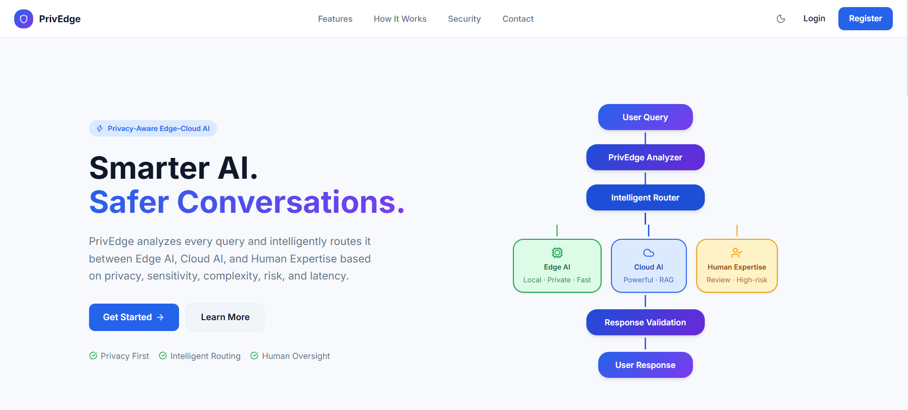 | 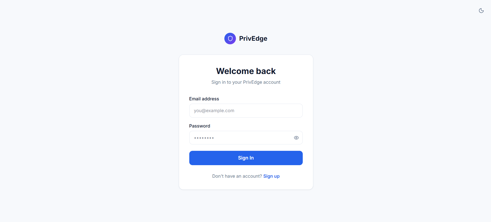 |

### 2. AI Assistant and Intelligent Routing

| AI Chatbot | Edge AI | Cloud AI |
|---|---|---|
| 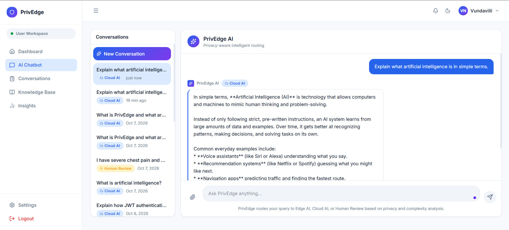 | 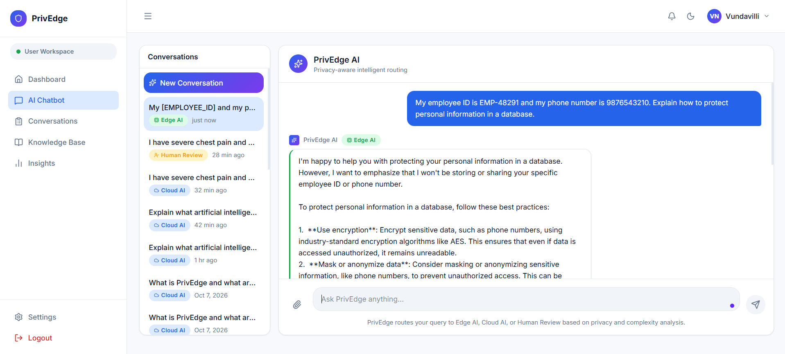 | 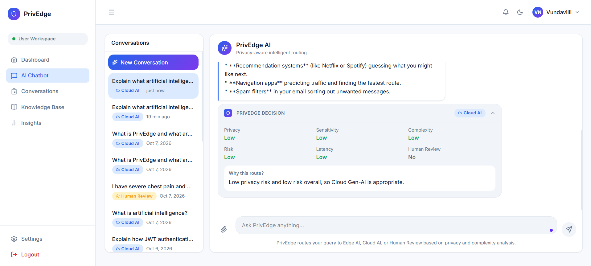 |

### 3. Human Review and Knowledge Base

| Human Review | Knowledge Base |
|---|---|
| 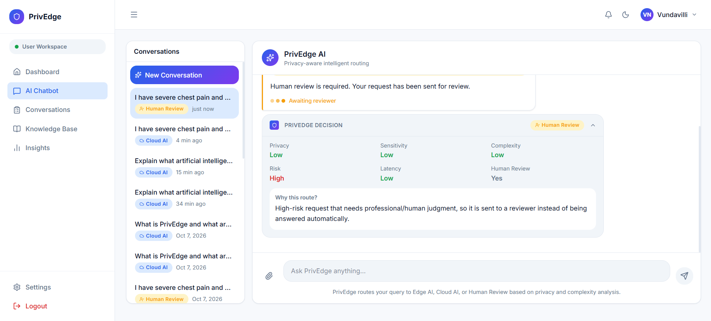 | 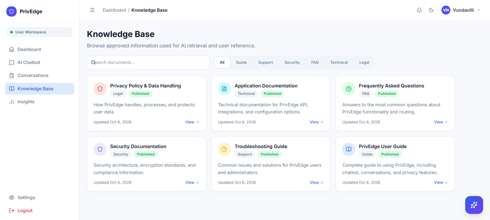 |

### 4. User Analytics

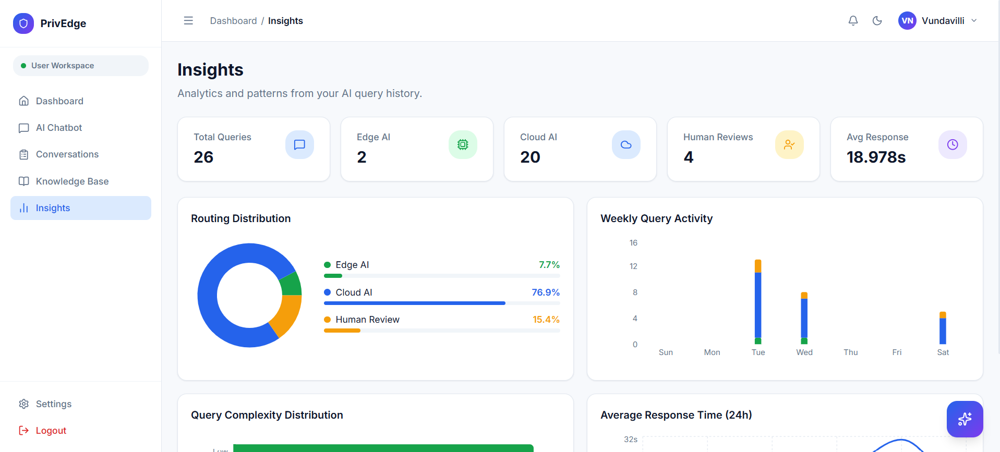

### 5. Reviewer and Administrator Dashboards

| Reviewer Dashboard | Admin Dashboard |
|---|---|
| 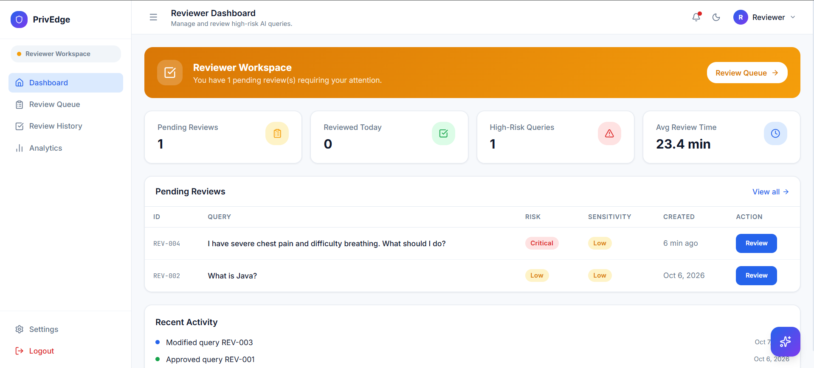 | 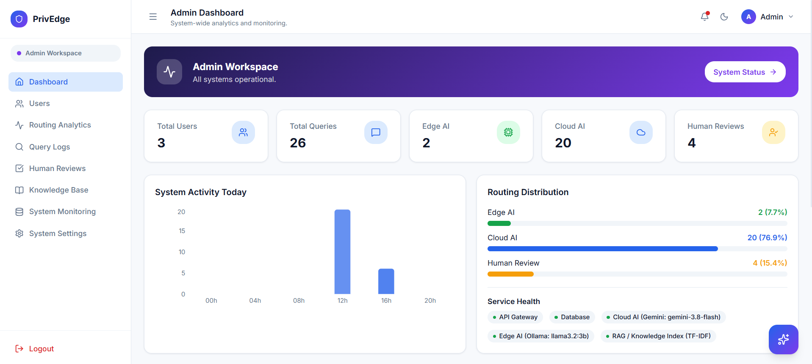 |

### 6. System Monitoring

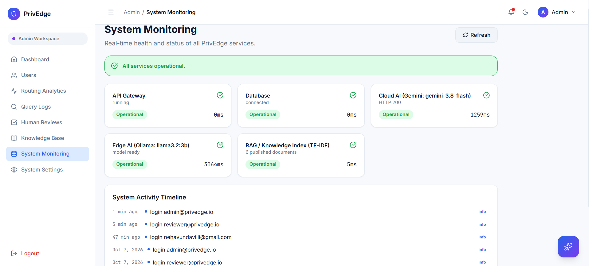
